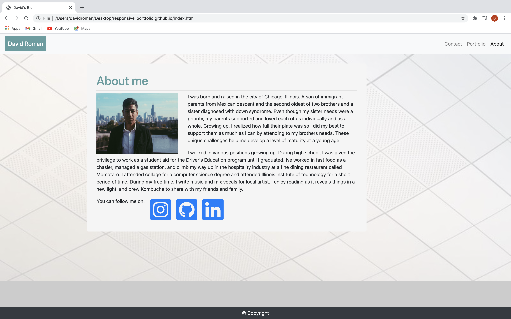
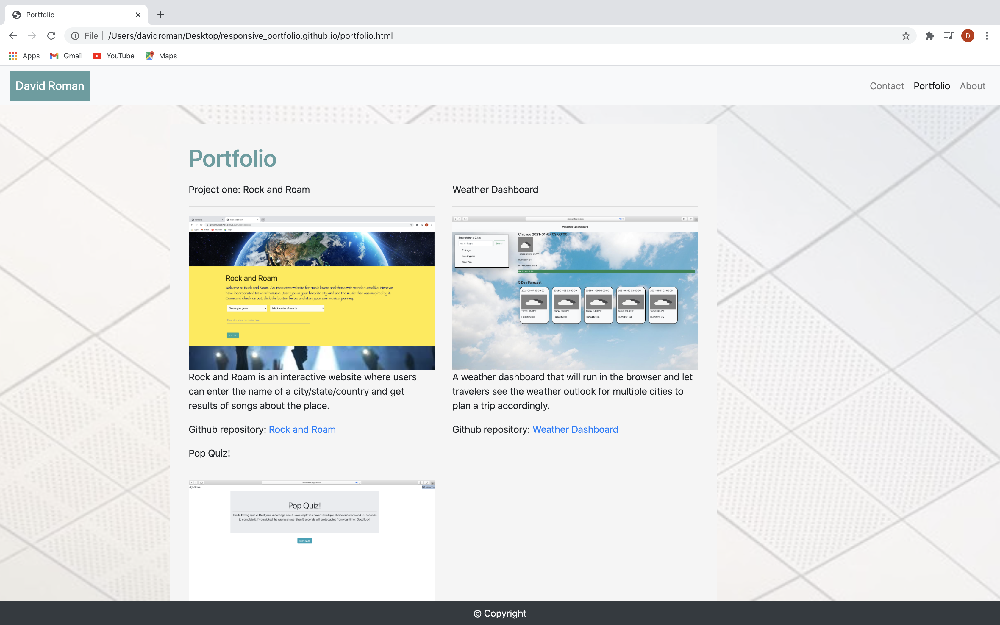
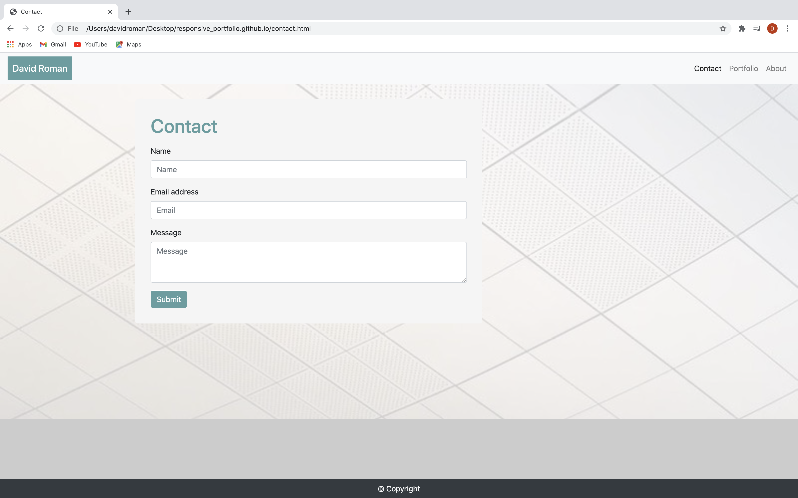

# Resonsive Portfolio 

This is a responsive website using Bootstrap to create a dynamic changes to the appearance of a website, depending on the screen size of the device being used to view it. RWD is one approach to the problem of designing for the multitude of devices available to customers, ranging from tiny phones to huge desktop monitors.

It includes a navbar with active links to About, Contact, and Portfolio pages. Images that are respionsive to the current size of the device, words that wrap around the image at a certain width of the page, and a active link to my instagram.  

Homepage

Portfolio

Contact
